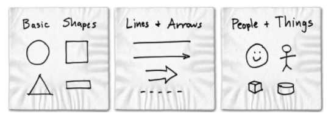
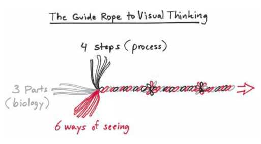

---
tags:
  - books
created: 2026-08-30
prev: 01-a-whole-new-way-of-looking-at-business
next: 03-a-gamble-we-cant-lose-the-four-steps-of-visual-thinking
---

[[01-a-whole-new-way-of-looking-at-business|‹ Previous]] | [[README|Home]] | [[03-a-gamble-we-cant-lose-the-four-steps-of-visual-thinking|Next ›]]

---

# 2. Which Problems, Which Pictures & Who is "WE"?

Regardless of context, problems share some things in common: they're hard to see, and their solutions are nearly invisible because of it.

> "That's where visual thinking came in: Any problem can be made clearer with a picture, and any picture can be created using the same set of tools and rules."

Pictures can represent complex concepts and sets of information as an easy-to-understand medium.

## The Six Problem "Clumps" (The 6 W's)

Most problems can be grouped into these categories:

1. **"Who and What" Problems** relating to things, people, and roles.
    - What is going on around me, and where do I fit in?
    - Who is in charge and who else is involved?
    - Where does responsibility lie?
2. **"How Much" Problems** involving measuring and counting.
    - Do we have enough of X to last as long as we need?
    - How much of X do we need to keep going?
    - If we increase this over here, can we decrease that over there?
3. **"When" Problems** relating to scheduling and timing.
    - What comes first, and what comes next?
    - We've got a lot of things to do, when are we going to do them all?
4. **"Where" Problems** relating to direction and how things fit together.
    - Where are we going now?
    - Are we headed in the right direction, or should we be moving elsewhere?
    - How do all these pieces fit together?
    - What's most important and what matters less?
5. **"How" Problems** relating to how things influence one another.
    - What will happen if we do this?
    - What about that?
    - Can we alter the outcomes of a situation by altering our actions?
6. **"Why" Problems** relating to seeing the big picture.
    - What are we really doing, and why?
    - Is it the right thing, or should we be doing something different?

> "Any problem can be helped with a picture."

## Pictures? What Pictures?

The three things needed to become great at problem solving with pictures:

1. Your eyes,
2. Your mind's eye,
3. Some hand-eye coordination.

Accessories:

1. Paper & Pen/Pencil
2. Whiteboard & Markers

Basic Shapes:

## The Hand is Mightier Than the Mouse

The symbols can all be drawn by hand, and that's important when you're starting out.

The more you rely on the three built-in visual thinking tools, the more you'll discover your innate visual thinking abilities.

This is helpful because:

1. **People like seeing other people's pictures.**
   People often respond better to hand-drawn images because the spontaneity and roughness makes them less intimidating.
2. **Hand-sketched images are quick to create, and easy to change.**
   Thinking with pictures is fluid, and visual trial-and-error happens frequently.
   Your first picture is hardly every what you end up with.
3. **Computers make it too easy to draw the wrong thing.**

## Black Pen, Yellow Pen, Red Pen: Who Is "We"?

There are broadly three categories of people:

1. **Black Pen:** They don't hesitate in putting the first marks on a page.
    - Confident in drawing simple images to summarise their ideas, and to help work through those ideas.
2. **Yellow Pen:** They are good at identifying the most important/interesting parts of what someone else has drawn.
    - Tend to be more verbal, incorporating more words/labels into their sketches.
3. **Red Pen:** Often, they have the most detailed grasp of the problem, they just need to be coaxed into sharing.

> "Regardless of visual thinking confidence or pen-colour preference, everybody already has good visual thinking skills, and everybody can easily improve those skills."

## The Guide Rope to Visual Thinking

There are three threads to visual thinking:

1. **Process:** Look, See, Imagine, Show.
2. **Biology:** Eyes, Mind's Eye, Hand-Eye Coordination.
3. **Seeing:** Who/What, How Much, Where, When, How, Why.
