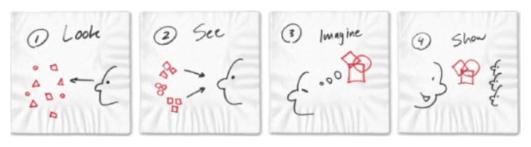
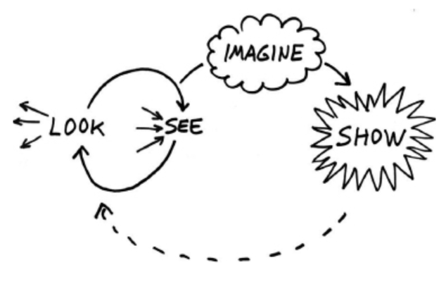

---
tags:
  - books
created: 2026-08-30
prev: 02-which-problems-which-pictures-who-is-we
next: 04-no-thanks-just-looking
---

[‹ Previous](02-which-problems-which-pictures-who-is-we.md) | [Home](../README.md) | [Next ›](../part-2-discovering-ideas/04-no-thanks-just-looking.md)

---

# 3. A Gamble We Can't Lose: The Four Steps of Visual Thinking

## Texas Hold 'em: The Table Stakes of Visual Thinking

Roam uses the example of Texas Hold 'em as an analogy for visual thinking.

1. **There is a process, and rules to govern it.**
   Visual thinking is a process guided by rules.
2. **We must make decisions with less-than-perfect information.**
   You will frequently have to make important decisions about which pictures to use before you have all the information.
3. **A complete visual language is make up of a small number of elements.**
   A small set of cues will represent an infinite number of problem-solving options.
4. **The process of playing poker is a great analogy to the process of visual thinking.**
   Poker involves _looking_ (collecting visual inputs), _seeing_ (selecting which of those visual inputs matter most, then recognizing pattern-making components within them), _imagining_ what will happen next, then _showing_.

### Looking

**Looking** is the semi-passive process of taking in visual information; it's collecting and screening.

**Questions:**

- What's there?
- Is there a lot of it?
- What's not there?
- How far am I able to look?
- What are the edges and limits of my vision in this situation?
- What do I recognise right away, and what throws me off?
- Are the things in front of me what I expected to see?
- Can I "get" them rapidly, or do I need to spend extra time figuring out what I'm looking at?

**Activities:**

- Scan across the whole landscape and build a big picture.
- Find the limits of your view, and the fundamentals of the data in front of you.
- Make an initial pass at screening out the noise.

### Seeing

**Seeing** is the active process of selecting which inputs are worth a more detailed inspection; it's selecting and clumping.

**Questions:**

- Do I know what I'm seeing?
- Have I seen this before?
- Are any patterns emerging?
- Does anything in particular stand out?
- What can I take away from what I see to help me make enough sense of things to make decisions about it?
- Have I collected enough visual inputs to make sense of things, or do I need to keep looking?

**Activities:**

- Filter for relevance.
- Categorise and make distinctions.
- Notice patterns and clump creatively.

### Imagining

**Imagining** is the manipulation of the information you have previously collected; it's seeing what isn't there.

**Questions:**

- Where have I seen this before? Can I make any analogies to things I've seen in the past?
- Are there better ways to configure the patterns I see? Can I rearrange them to make more sense?
- Can I manipulate the patterns so that the invisible becomes visible?
- Is there a hidden framework connecting everything I saw? Can I use it as a place to put other things I've seen?

**Activities:**

- With all visual inputs fresh in your mind, close your eyes and try to see hidden connections.
- Ask "where have I seen this before?" and imagine how analogous solutions might work here.
- Manipulate the patterns to see if something new emerges.
- Alter what you see to try find another way of showing it.

### Showing

**Showing** is summarising what you've seen and internalised, and presenting it to others; it's making it all clear.

**Questions:**

- What are the three most important pictures of everything that I've imagined?
- What's the best way to visually convey my idea?
- When I go back to what I originally looked at, does what I'm showing still make sense?
- Challenge your audience; do they see the same as you, or something different?

**Activities:**

- Clarify your best ideas so the most relevant come to the top.
- Pick the best visual framework to get your ideas down.
- Make the _who/what_, _how much_, _where_ and _when_ are always visible, then let the _how_ and _why_ be the punch line.

## It's Not Always Linear, Actually

