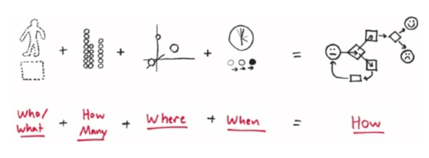

---
tags:
  - books
created: 2026-08-30
prev: 04-no-thanks-just-looking
next: 06-the-squid-a-practical-lesson-in-applied-imagination
---

[‹ Previous](04-no-thanks-just-looking.md) | [Home](../README.md) | [Next ›](06-the-squid-a-practical-lesson-in-applied-imagination.md)

---

# 5. The Six Ways of Seeing

> "Seeing is the flip side of looking: Looking is the open process of collecting visual information, seeing is the narrowing process of putting the visual pieces together in order to make sense of them."

## The Bird-Dog Drill

The Bird-Dog Drill is designed to showcase the six ways we see and it goes like this:

1. Picture someone you know who makes you feel good.
2. Picture your favourite dog.
3. Picture someone pushing a baby carriage.
4. Picture a bird.
5. Picture an outdoor place where there is a bench you can sit on.
6. See your full scene.

### The Six Ways We See

The six ways we see are:

1. We Saw Objects: the _Who_ and the _What_.
2. We Saw Quantities: the _How Many_ and _How Much_.
3. We Saw Position in Space: the _Where_.
4. We Saw Position in Time: the _When_.
5. We Saw Influence and Cause and Effect: the _How_.
6. We Saw All of This Come Together and "Knew" Something About Our Scene: the _Why_.

The first four ways of seeing are largely independent but, as you watched your scene unfold in your mind, you started to see chains of reactions, i.e., the _how_.

- You need to combine at least two of the previous W's in order to see the _how_.

> The first four W's serve as the raw materials that we build together in order to see _how_ things happen.

The last W, the _why_, is in the links between each of the other W's.

- You are able to make best guesses about the next event that will happen, and that's based on your experiences.
- Because the _why_ is subjective, different people will have different _why_'s based on their lived experiences and will be able to explain it.

## Putting the Six Ways to Work

> "All it usually takes to see a problem clearly is to consciously seek out the 6 W's."

