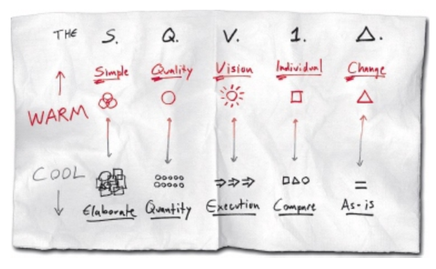
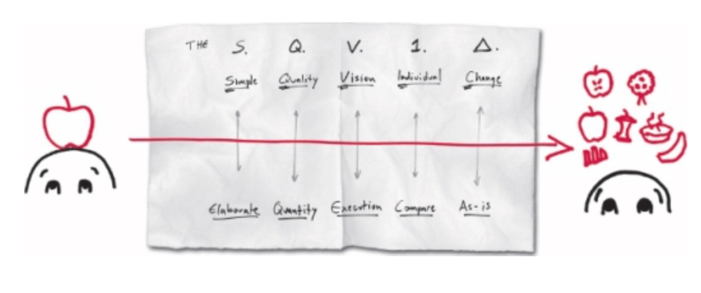
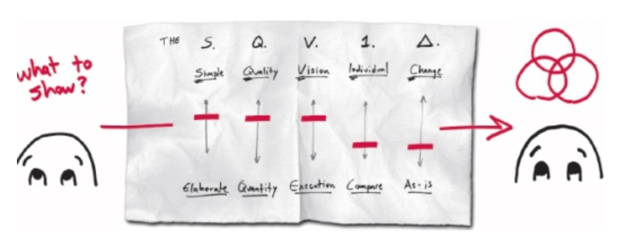

---
tags:
  - books
created: 2026-08-30
prev: 05-the-six-ways-of-seeing
next: 07-frameworks-for-showing
---

[‹ Previous](05-the-six-ways-of-seeing.md) | [Home](../README.md) | [Next ›](07-frameworks-for-showing.md)

---

# 6. The SQVID: A Practical Lesson in Applied Imagination

With all the information that your eyes have collected, it's time to start _seeing_ in ways that don't require your eyes at all; to start imagining.

- When you're imagining, you're using the same high-level mental vision processing centres that you do when your eyes are open.

The SQVID is a stand-alone exercise that can be used anytime, anywhere to fully engage your visual imagination.

It helps us do two critical tasks:

1. It activates every corner of your mind's eye to realise a mental image.
2. It helps you see that image through the eyes of your audience.

## Enter the SQVID: The Full Brain Workout

The SQVID is a series of five questions that you walk an idea through to bring it to visual clarity and to refine its focus.

- It helps you imagine what visual messages you'd like to convey _before_ you start to draw.

Do I want to show:

- S: Simple vs. Elaborate?
- Q: Quality vs Quantity?
- V: Vision vs. Execution?
- I: Individual Attributes vs. Comparison?
- D: Delta (Change) vs. Status Quo?

- The upper part of the SQVID is the "warm" because it skews towards the creative attributes, i.e., the descriptive, the synthetic, the different, the abstract, the difficult-to-measure attributes.
- The lower part of the SQVID is the "cool" because it skews towards the more business-centred attributes, i.e., the numeric, the analytic, the detailed, the factual, and the measured.

### Pathway 1: Create a Visual Description for Each End

This pathway through SQVID forces your visual system to switch gears back and forth as you move through the questions, generating ten opposite views.

- It's ideal for generating an unexpectedly broad number of ways to represent your idea, leaving you with many views to choose from when it's time to _show_.

### Pathway 2: Focus on the Types of Picture Most-Relevant to Your Audience

The second pathway through SQVID focuses less on the idea itself, and more on how to make it impact more with your audience.

- You identify which "settings" are most useful to your audience, regardless of the details of what you're trying to describe.

### The SQVID is Brain Food for the Whole Brain

By forcing yourself to look at your idea from every point on the SQVID, you activate both the left _("analytic")_ and right _("creative")_ sides of your brain.

- Because of this, the SQVID is a great way to get groups of businesspeople who don't immediately see each others' points of view to see eye-to-eye.

## The SQVID in Action

### Question 1: Simple or Elaborate?

> "The real goal of visual thinking is to make the complex understandable by making it visible - not by making it simple."

Regardless of who you are delivering to, you can essentially give the same speech, keeping your various audiences engaged by changing the level of simplicity vs. elaboration to match their level of expertise.

### Question 2: Quality or Quantity?

> "As instrumentation designers, our biggest challenge is deciding how much information _not_ to show, and how to trick people into perceiving what we most want them to see."

### Question 3: Vision or Execution?

> "Sometimes the most important message a business audience can hear from its leaders is that 'we know where we're going.' Other times, all the audience needs to hear is that 'we know exactly how we're going to get there.'"

> "What makes a Gantt chart useful in showing how to get to a successful project outcome is that it _visually_ shows the steps that need to take place, represents those steps in order, and clearly illustrates how any one step is dependent upon others."

### Question 4: Individual or Compare?

Sometimes, all you'll need to do is showcase your idea on its own, letting its morals speak for themselves.

Other times, you'll need to showcase your idea in comparison to others, letting others come to the conclusion that your idea is _better_ than the others.

### Question 5: Delta (Change) or Status Quo?

> "The team was happy with that. Although it did nothing to address _how_, it at least showed the situation they'd like to have, and served as a starting point for imagining a better future."
