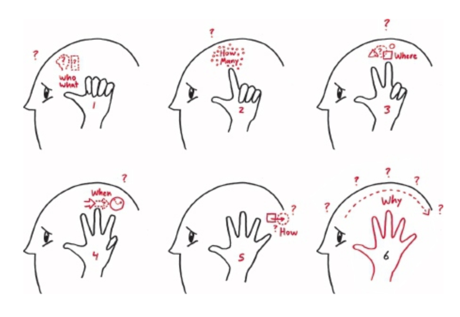
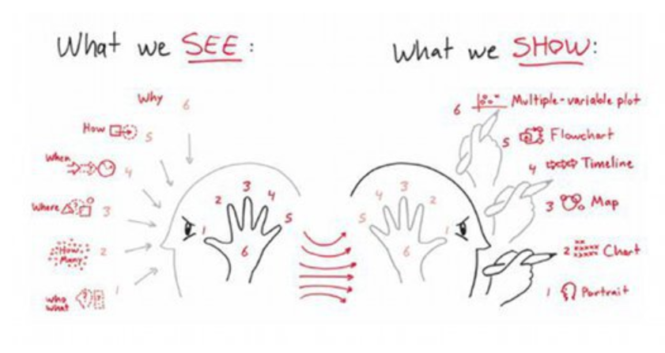
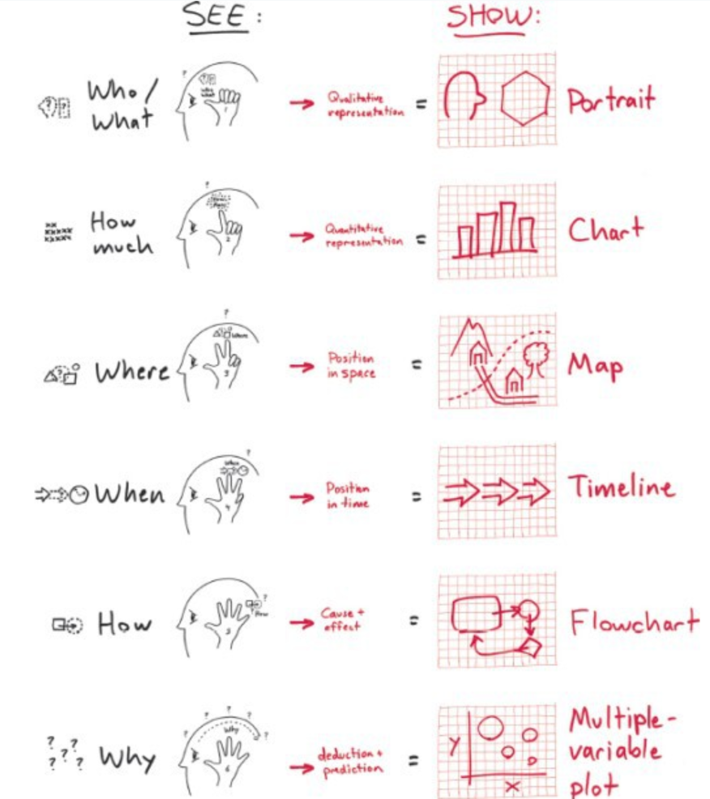
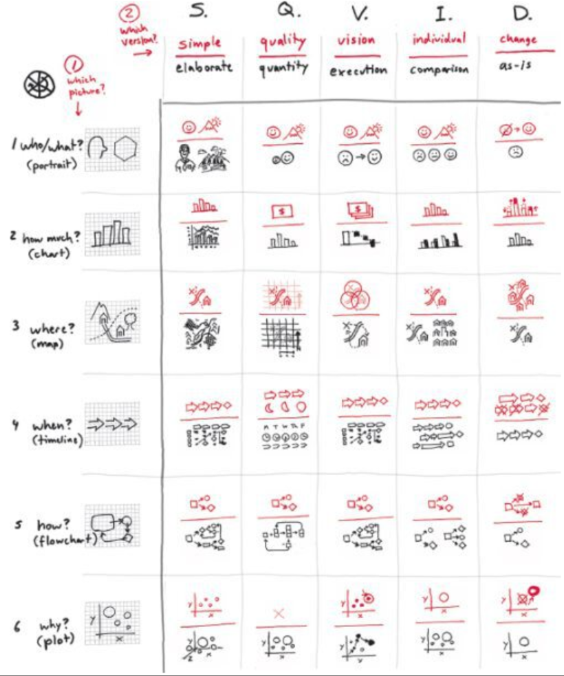

---
tags:
  - books
created: 2026-08-30
prev: 06-the-sqvid-a-practical-lesson-in-applied-imagination
next: 08-showing-and-the-visual-thinking-mba
---

[‹ Previous](06-the-sqvid-a-practical-lesson-in-applied-imagination.md) | [Home](../README.md) | [Next ›](../part-3-developing-ideas/08-showing-and-the-visual-thinking-mba.md)

---

# 7. Frameworks for Showing

> "This tendency to equate **visual** thinking with the creation of elaborate and refined drawings is just plain wrong. It approaches the process of visual thinking backward, limiting our most powerful problem-solving ability before we've even had a chance to use it."

> "Showing is not only our chance to wrap up our ideas so that we can share them with someone else, this step is also when we invariably make our biggest breakthroughs - but only if we've already looked, seen, and imagined well."

There are three steps to _showing_ well:

1. **Select the Right Framework.**
   Choose one of the frameworks from the common six (shown below).
2. **Use That Framework to Create a Picture.**
   Start by laying in an appropriate coordinate system, then add data and visual details gradually.
3. **Explain the Picture to Someone Else.**
   A good problem-solving picture is always easy to explain, no matter how complex its contents or meaning.

And only one of those three needs any drawing.

## Seeing Becomes Showing

[Chapter 5](05-the-six-ways-of-seeing.md) ended with "The Six Ways We See" and, since our vision system normally sees things in this way, take advantage of that when creating clear pictures.

> "If we see in six ways, it makes sense that we should be able to show in six ways as well."

## The <6><6> Rule

> "For every one of the six ways of seeing, there is one corresponding way of showing."
>
> "For each one of these six ways of showing, there is a single visual framework that serves as a starting point."

The mappings from what we see and what we show are:

1. Who/What = Portrait
2. How Many = Chart
3. Where = Map
4. When = Timeline
5. How = Flowchart
6. Why = Multi-Variable Plot

### Implications for Visual Thinking

The <6><6> model has many implications for visual thinking:

- All of the possible charts are derived from just six basic "showing frameworks" (or a combination of those six).
- Learning when to apply these frameworks and how to draw them lets you create a pictorial representation of any problem.
- Any problem that you can see can also be shown by representing those same 6 W's.
- The best way to show a visual category is to just flip around the way we see it in the real world.

### What Defines a Showing Framework

There are four criteria used to define each framework and differentiate them:

1. **What the framework shows.**
   Which of the 6 W's are being shown, determined by the <6><6> model.
2. **   The framework's underlying coordinate system.**
   The structure of the picture derived from the <6><6> model, whether spatial, temporal, conceptual, or causal.
3. **The relationship between the objects contained within the framework.**
   How objects in the framework relate through their traits, quantity, spatial or temporal position, influence, or combinations of these.
4. **The framework's starting point.**
   Top, centre, beginning, end, etc.

## Mapping It All Together: The Visual Thinking Codex

Now, you have two ways of thinking about showing your problem:

1. The six frameworks derived from the <6><6> model,
2. The five imagination-focusing questions of the SQVID.

While they look and function differently, they force your mind to think in different ways.

At the intersection of each framework and each point of the SQVID are two icons, one for each SQVID option.

